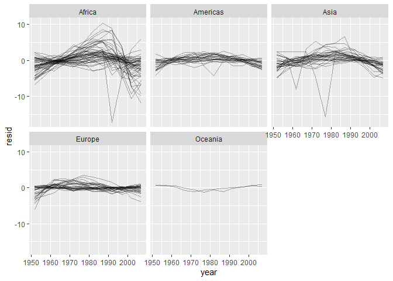

happy git with r test markdown
================
Mikus
2022-02-14

``` r
library(gapminder)
library(tidyverse)
```

    ## -- Attaching packages --------------------------------------- tidyverse 1.3.1 --

    ## v ggplot2 3.3.5     v purrr   0.3.4
    ## v tibble  3.1.6     v dplyr   1.0.7
    ## v tidyr   1.1.4     v stringr 1.4.0
    ## v readr   2.1.1     v forcats 0.5.1

    ## -- Conflicts ------------------------------------------ tidyverse_conflicts() --
    ## x dplyr::filter() masks stats::filter()
    ## x dplyr::lag()    masks stats::lag()

``` r
library(modelr)
# lm function
country_model <- function(df) {
        lm(lifeExp ~ year, data = df)
}

# nested data
by_country <- gapminder %>% 
        group_by(country, continent) %>% 
        # create nested data
        nest() %>% 
        # run lm function
        mutate(model = map(data, country_model)) %>% 
        # add residuals
        mutate(resids = map2(data, model, add_residuals))

resids <- unnest(by_country, resids) %>% 
        ggplot(aes(year, resid)) +
        geom_line(aes(group = country),
                  alpha = 1/3) +
        facet_wrap((~continent))
resids
```

<!-- -->
